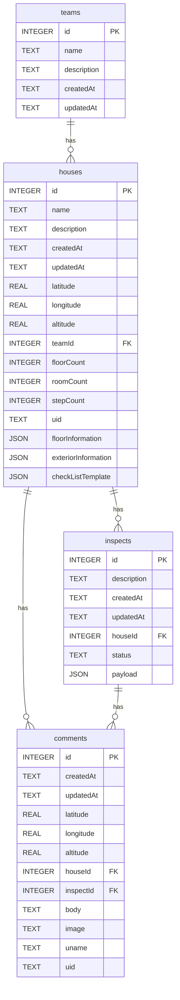

# 公共賃貸住宅維持管理システム

公共賃貸住宅の点検・維持管理を効率化するためのデスクトップアプリケーション。

## 主な機能

- **チーム管理**: チームの作成・切り替え
- **住宅物件管理**: 物件情報の登録、地図上での表示
- **地理情報機能**: 住所から座標検索、標高情報の取得
- **点検・検査機能**: チェックリストによる点検記録
- **コメント機能**: 位置情報・画像付きのコメント追加

## 技術スタック

| レイヤー       | 技術                           |
| -------------- | ------------------------------ |
| フレームワーク | Next.js 16 + React 19          |
| 言語           | TypeScript / Rust              |
| デスクトップ   | Tauri 2.x                      |
| 状態管理       | Zustand                        |
| データベース   | SQLite                         |
| 地図           | Leaflet                        |
| テスト         | Vitest + React Testing Library |

## 必要要件

- Node.js 20以上
- pnpm 10以上
- Rust（Tauriビルド用）

## セットアップ

```bash
# 依存関係のインストール
pnpm install

# 開発サーバー起動
pnpm dev

# Tauriアプリとして起動
pnpm tauri dev
```

## ビルド

```bash
# Next.js静的ファイル生成
pnpm build

# Tauriアプリをビルド
pnpm tauri build
```

## スクリプト

| コマンド         | 説明             |
| ---------------- | ---------------- |
| `pnpm dev`       | 開発サーバー起動 |
| `pnpm build`     | 静的ファイル生成 |
| `pnpm lint`      | ESLint実行       |
| `pnpm format`    | Prettier整形     |
| `pnpm typecheck` | 型チェック       |
| `pnpm test`      | Vitestテスト実行 |

## ディレクトリ構成

```
├── app/                # Next.js App Router
├── components/         # Reactコンポーネント
│   ├── elements/      # 基本UI要素
│   ├── features/      # 機能別コンポーネント
│   └── modules/       # 再利用可能モジュール
├── lib/               # ユーティリティ・ロジック
│   ├── models/        # データベースモデル
│   └── constants/     # 定数
├── src-tauri/         # Tauriバックエンド（Rust）
└── public/            # 静的ファイル
```

## データベース構成



## ライセンス

Copyright © 2026 Building Research Institute, Japan / 国立研究開発法人 建築研究所

Permission is hereby granted, free of charge, to any person obtaining a copy of this software and associated documentation files (the “Software”), to deal in the Software without restriction, including without limitation the rights to use, copy, modify, merge, publish, distribute, sublicense, and/or sell copies of the Software, and to permit persons to whom the Software is furnished to do so, subject to the following conditions: The above copyright notice and this permission notice shall be included in all copies or substantial portions of the Software. THE SOFTWARE IS PROVIDED “AS IS”, WITHOUT WARRANTY OF ANY KIND, EXPRESS OR IMPLIED, INCLUDING BUT NOT LIMITED TO THE WARRANTIES OF MERCHANTABILITY, FITNESS FOR A PARTICULAR PURPOSE AND NONINFRINGEMENT. IN NO EVENT SHALL THE AUTHORS OR COPYRIGHT HOLDERS BE LIABLE FOR ANY CLAIM, DAMAGES OR OTHER LIABILITY, WHETHER IN AN ACTION OF CONTRACT, TORT OR OTHERWISE, ARISING FROM, OUT OF OR IN CONNECTION WITH THE SOFTWARE OR THE USE OR OTHER DEALINGS IN THE SOFTWARE.

許可は、以下の条件を満たす限りにおいて、無料で繰り返し使用、コピー、変更、マージ、公開、配布、サブライセンス、および/または販売することができます。上記の著作権表示および本許諾表示を、ソフトウェアのすべてのコピーまたは重要な部分に含めること。本ソフトウェアは、明示黙示を問わず、商業利用、特定の目的への適合性、および非侵害性に関する暗黙の保証を含め、いかなる種類の保証も提供しません。著作権者または本ソフトウェアの使用に関与した人物は、いかなる場合も、契約、不法行為またはその他の行為に基づき、ソフトウェアに起因または関連し、またはソフトウェアの使用またはその他の取引に関連して生じた契約外の損害について責任を負うことはありません。
